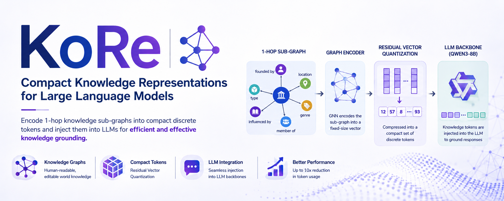

# KoRe: Compact Knowledge Representations for Large Language Models

Modern Large Language Models (LLMs) have shown impressive performances in user-facing tasks such as question answering, as well as consistent improvements in reasoning capabilities.
Still, the way these models encode knowledge seems inherently flawed: by design, LLMs encode world-knowledge within their parameters. This way of representing knowledge is inherently opaque, difficult to debug and update, and prone to hallucinations.
On the other hand, Knowledge Graphs can provide human-readable and easily editable world knowledge representations, and their application in knowledge-intensive tasks has consistently proven beneficial to downstream performance.
Nonetheless, current integration techniques require extensive retraining or finetuning. 
To overcome this issue, we introduce KoRe, a methodology to encode 1-hop sub-graphs into compact discrete knowledge tokens and inject them into a LLM backbone. We test the proposed approach on three established benchmarks, and report competitive performances coupled with a significant reduction (up to 10x) in token usage. 
Our results show that compact discrete KG representations can efficiently and effectively be used to ground modern LLMs.

## Dataset

The model is primarily trained on the **Tri-Rex dataset**, which provides factual statements with associated knowledge graph contexts
Other datasets used are the test split of the web-QSP data mapped to WikiData entities, and the simple questions dataset.
GrailQA was not used for the results in the paper as it required a long time to preprocess, but it can be used for evaluation and training as well. 

### Data preparation

To prepare the datasets, run the `create_hf_datasets.py` script with the appropriate configuration file.
The script will use the base path of the search for the following dataset files:
- TriRex_v1.tar (+lite) [webpage](https://zenodo.org/records/15166163)
- TRExStar_v1.tar (+lite) [webpage](https://zenodo.org/records/15165974)
- TrexBite_v1.tar (+lite) [webpage](https://zenodo.org/records/15165883)
- grailqa_v1.0_train.json & grailqa_v1.0_dev.json (the test set lacks fields needed for our preprocessing) from this [archive](https://dl.orangedox.com/WyaCpL?dl=1) 
- webqsp.examples.test.wikidata.json (used only for evaluation): you can get it from the folder `input` in the following [zip](https://public.ukp.informatik.tu-darmstadt.de/coling2018-graph-neural-networks-question-answering/WebQSP_WD_v1.zip) (link from [Github](https://github.com/UKPLab/coling2018-graph-neural-networks-question-answering/blob/master/WEBQSP_WD_README.md))
- [train](https://github.com/askplatypus/wikidata-simplequestions/raw/master/annotated_wd_data_train_answerable.txt), [val](https://github.com/askplatypus/wikidata-simplequestions/raw/master/annotated_wd_data_valid_answerable.txt) and [test](https://github.com/askplatypus/wikidata-simplequestions/raw/master/annotated_wd_data_test_answerable.txt) splits of the simple questions dataset mapped to WD.
These files need to be downloaded and placed in the base path provided in the configuration file.

NOTE: some of the steps require internet access, if your compute nodes do not have it you can try to run the scipt for the lite version of the data first, then you should be able to run the full version without internet access.

## Model

The model architecture can be divided into the following components:
1. **Graph Encoder**: Graph Neural Network to encode the 1-hop sub-graph into a fixed-size vector representation
2. **Residual Vector Quantization**: To compress the graph representation into a compact discrete set of tokens
3. **Base Language Model**: Qwen3-8B (configurable) as the backbone LLM to inject the knowledge tokens into
4. **LoRA**: LoRA fine-tuning with optional full model tuning

### Model Configurations

The model hyperparameters are controlled through YAML configuration files, the ones used for training and evaluation are available in the `configs/` directory and can be modified as needed.

### Training

To train the model, run the `train.py` script with the appropriate configuration file.
To run the training using accelerate, take a look at launchers/train.sh for an example of how to launch the training on multiple GPUs. The training script will handle the data loading, model initialization, and optimization process according to the specified configuration.
Accelerate and deepspeed configuration examples can be found in the `configs/` directory as well, and can be modified to fit your specific hardware setup and requirements.

### Evaluation

To evaluate the model, run the `evaluate.py` script with the appropriate configuration file. The evaluation script will compute the relevant metrics for each dataset and output the results.
Similarly to training, you can use accelerate to run the evaluation on multiple GPUs, and the configuration examples can be found in the `configs/` directory.
